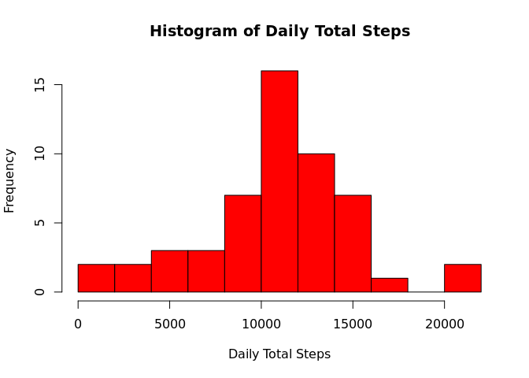
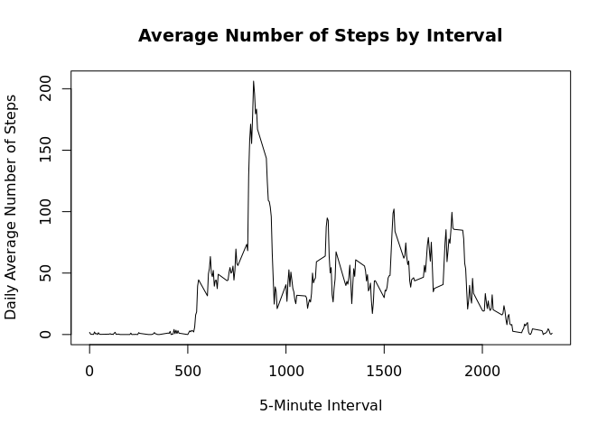
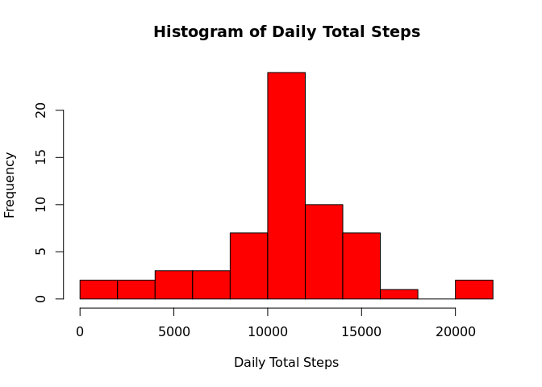
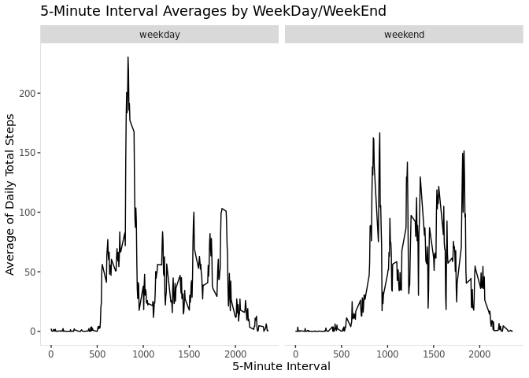

## Step 1: Loading and preprocessing the data

In this first step, we will load the data and prepare the data for further
analysis.


```r
library(data.table)
library(ggplot2)
library(lubridate)
```

```
## Warning in system("timedatectl", intern = TRUE): running command 'timedatectl'
## had status 1
```

```
## 
## Attaching package: 'lubridate'
```

```
## The following objects are masked from 'package:data.table':
## 
##     hour, isoweek, mday, minute, month, quarter, second, wday, week,
##     yday, year
```

```
## The following objects are masked from 'package:base':
## 
##     date, intersect, setdiff, union
```

Loading the data:

```r
activity <- read.table(unzip("activity.zip"), header=TRUE, sep = ",")
activity <- as.data.table(activity)

head(activity)
```

```
##    steps       date interval
## 1:    NA 2012-10-01        0
## 2:    NA 2012-10-01        5
## 3:    NA 2012-10-01       10
## 4:    NA 2012-10-01       15
## 5:    NA 2012-10-01       20
## 6:    NA 2012-10-01       25
```
Since the date is stored as a character column, it would have to be combined
with interval to create a datetime format


```r
activity[, datetime := strptime(date, "%Y-%m-%d") + minutes(interval)]
```

```
## Warning in strptime(date, "%Y-%m-%d"): strptime() usage detected and wrapped
## with as.POSIXct(). This is to minimize the chance of assigning POSIXlt columns,
## which use 40+ bytes to store one date (versus 8 for POSIXct). Use as.POSIXct()
## (which will call strptime() as needed internally) to avoid this warning.
```

```r
head(activity)
```

```
##    steps       date interval            datetime
## 1:    NA 2012-10-01        0 2012-10-01 00:00:00
## 2:    NA 2012-10-01        5 2012-10-01 00:05:00
## 3:    NA 2012-10-01       10 2012-10-01 00:10:00
## 4:    NA 2012-10-01       15 2012-10-01 00:15:00
## 5:    NA 2012-10-01       20 2012-10-01 00:20:00
## 6:    NA 2012-10-01       25 2012-10-01 00:25:00
```
Also, change the format of "date" column to "date", as well.


```r
activity[, date := as.Date(date, "%Y-%m-%d")]
head(activity)
```

```
##    steps       date interval            datetime
## 1:    NA 2012-10-01        0 2012-10-01 00:00:00
## 2:    NA 2012-10-01        5 2012-10-01 00:05:00
## 3:    NA 2012-10-01       10 2012-10-01 00:10:00
## 4:    NA 2012-10-01       15 2012-10-01 00:15:00
## 5:    NA 2012-10-01       20 2012-10-01 00:20:00
## 6:    NA 2012-10-01       25 2012-10-01 00:25:00
```

## Step 2: What is mean total number of steps taken per day?

#### Calculate the Total Number of Steps per day

```r
mean_steps = activity[, .(total_steps=sum(steps)), by=date]
```

#### Create a Histogram

```r
hist(x = mean_steps$total_steps
         , breaks = 12
         , freq = TRUE
         , main = "Histogram of Daily Total Steps"
         , xlab = "Daily Total Steps"
         , ylab = "Frequency"
         , col = "red")
```

<!-- -->

```r
png("figures/histogram_raw.png", width = 480, height = 480)

hist(x = mean_steps$total_steps
         , breaks = 12
         , freq = TRUE
         , main = "Histogram of Daily Total Steps"
         , xlab = "Daily Total Steps"
         , ylab = "Frequency"
         , col = "red")

dev.off()
```

```
## png 
##   2
```

#### Calculate and report the mean and median of the total number of steps taken per day

```r
mean(mean_steps$total_steps, na.rm = TRUE)
```

```
## [1] 10766.19
```

```r
median(mean_steps$total_steps, na.rm = TRUE)
```

```
## [1] 10765
```
The mean daily steps is 10,766

The median daily steps is 10,765

## Step 3: What is the average daily activity pattern?


```r
interval_averages = activity[, .(mean_steps=mean(steps, na.rm = TRUE)), by=interval]
```

#### 5-Minute Time Series Plot and Average

Create a 5-minute time series plot (x-axis) and the average number of steps
across all all days (y-axis)


```r
plot(interval_averages$interval
     , na.omit(interval_averages$mean_steps)
     , type = "l"
     , ylab = "Daily Average Number of Steps"
     , xlab = "5-Minute Interval"
     , main = "Average Number of Steps by Interval"
)
```

<!-- -->

```r
png("figures/lineplot.png", width = 480, height = 480)

plot(interval_averages$interval
     , na.omit(interval_averages$mean_steps)
     , type = "l"
     , ylab = "Daily Average Number of Steps"
     , xlab = "5-Minute Interval"
     , main = "Average Number of Steps by Interval"
)

dev.off()
```

```
## png 
##   2
```

#### Interval with Max Number of Steps

Interval with the max daily average number of steps (206 steps) is 835.

835 corresponds to 1:55 PM - 2:00 PM 5-minute interval.

## Step 4: Imputing missing values

#### Total Number of Missing Values in the dataset

```r
sum(is.na(activity$steps))
```

```
## [1] 2304
```
Out of the 17,568 records, 2,304 records have missing values.

#### Strategy
Strategy for filling in all of the missing values.

2 steps for filling in the missing values.
1. Calculate the daily average number of steps for each interval
    (with NAs removed)
2. If any intervals have NAs for all days, then set the total steps for that
    interval to zero (0).
3. Impute the missing values with the daily average number of steps for interval

#### Imputed Dataset
Create a new dataset with missing data filled in

1. Daily average number of steps for each interval
    Note: This step was completed earlier in Step 3.
2. If any intervals have NAs for all days, then set the total steps for that
    interval to zero (0).

```r
interval_imputation <- as.data.table(unique(activity$interval))
## Rename the column 
setnames(interval_imputation, old=c("V1"), new=c("interval"))
## Merge the daily average number of steps for each interval
interval_imputation <- interval_averages[interval_imputation, on = .(interval)]
sum(is.na(interval_imputation$mean_steps))
```

```
## [1] 0
```

```r
## Round the mean_steps
interval_imputation[, mean_steps := round(mean_steps, digits=0)]
#interval_imputation$mean_steps <- round(interval_imputation$mean_steps, digits=0)
## Create new data table with activity and mean steps
activity_imputed <- merge(interval_imputation
                          , activity
                          , by = "interval"
                          , all.x = TRUE)
##  Impute the missing values with daily average number of steps for interval
for (i in 1:nrow(activity_imputed)) {
    if (is.na(activity_imputed[i,"steps"])) {
        activity_imputed[i,"steps"] <- activity_imputed[i,"mean_steps"]
    }
}
```

#### Histogram of daily steps

1. Histogram of total steps per day.

```r
mean_steps_imputed <- activity_imputed[, .(total_steps=sum(steps)), by=date]

hist(x = mean_steps_imputed$total_steps
         , breaks = 12
         , freq = TRUE
         , main = "Histogram of Daily Total Steps"
         , xlab = "Daily Total Steps"
         , ylab = "Frequency"
         , col = "red")
```

<!-- -->

```r
png("figures/histogram_imputed.png", width = 480, height = 480)

hist(x = mean_steps_imputed$total_steps
         , breaks = 12
         , freq = TRUE
         , main = "Histogram of Daily Total Steps"
         , xlab = "Daily Total Steps"
         , ylab = "Frequency"
         , col = "red")

dev.off()
```

```
## png 
##   2
```
2. Calculate the mean and median of daily total steps.

```r
mean(mean_steps_imputed$total_steps, na.rm = TRUE)
```

```
## [1] 10765.64
```

```r
median(mean_steps_imputed$total_steps, na.rm = TRUE)
```

```
## [1] 10762
```
After imputing, the mean for the daily total steps is 10,766.
The mean has not changed, after rounding.
After imputing, the median for the daily total steps is 10,762.
The median has decreased by 3 steps, after imputing.

## Step 5: Are there differences in activity patterns between weekdays and weekends?

#### Indicator
Create a factor variable with two levels - "weekday" and "weekend"

```r
weekendInd <- function (x) {
                weekday <- x["DayOfWeek"]
                weekend <- c("Sat", "Sun")
                if (weekday %in% weekend) {
                    return("weekend")
                }
                else {
                    return("weekday")
                }
            }

activity_imputed[, DayOfWeek := weekdays(datetime, abbr = TRUE)]
activity_imputed$weekendInd <- apply(activity_imputed, 1, weekendInd)
```

#### Panel Plot
Make a panel plot containing a type = "l" plot of the 5-minute interval(x-axis) and the average number of steps taken, averaged across all weekday days or weekend days (y-axis). See the README file in the GitHub repository to see an example of what this plot should look like using simulated data.


```r
interval_averagesImputed <- activity_imputed[, .(mean_steps = mean(steps)), by=list(interval, weekendInd)]
interval_averagesImputed
```

```
##      interval weekendInd mean_steps
##   1:        0    weekday  2.2888889
##   2:        0    weekend  0.2500000
##   3:        5    weekday  0.4000000
##   4:        5    weekend  0.0000000
##   5:       10    weekday  0.1555556
##  ---                               
## 572:     2345    weekend  0.1764706
## 573:     2350    weekday  0.2727273
## 574:     2350    weekend  0.0000000
## 575:     2355    weekday  1.2272727
## 576:     2355    weekend  0.6470588
```

```r
theme <- theme(panel.grid.major = element_blank(),
               panel.grid.minor = element_blank(),
               panel.background = element_blank(),
               axis.line.x = element_line(color="#919191", size = 0.1),
               axis.line.y = element_line(color="#919191", size = 0.1)
)

png("figures/panelplot.png", width = 480, height = 480)

gg <- ggplot(interval_averagesImputed)
gg <- gg + geom_line(aes(x = interval, y = mean_steps),
                    position = "stack",
                    stat = "identity")
gg <- gg + theme
gg <- gg + xlab("5-Minute Interval")
gg <- gg + ylab("Average of Daily Total Steps")
gg <- gg + labs(fill='Weekend?')
gg <- gg + ggtitle("5-Minute Interval Averages by WeekDay/WeekEnd")
gg <- gg + facet_wrap(~weekendInd)
print(gg)

dev.off()
```

```
## png 
##   2
```

```r
gg <- ggplot(interval_averagesImputed)
gg <- gg + geom_line(aes(x = interval, y = mean_steps),
                    position = "stack",
                    stat = "identity")
gg <- gg + theme
gg <- gg + xlab("5-Minute Interval")
gg <- gg + ylab("Average of Daily Total Steps")
gg <- gg + labs(fill='Weekend?')
gg <- gg + ggtitle("5-Minute Interval Averages by WeekDay/WeekEnd")
gg <- gg + facet_wrap(~weekendInd)
print(gg)
```

<!-- -->
